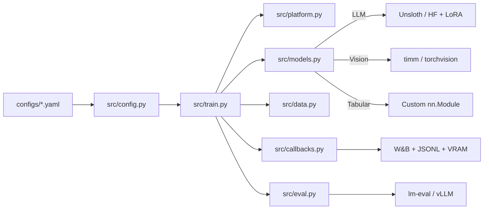

<div align="center">

# ML Experiment Scaffold

**Production ML experiment infrastructure for single-GPU homelab**

[](https://github.com/omnipotence-eth/ml-experiment-scaffold/actions/workflows/ci.yml)
[](https://python.org)
[](https://github.com/astral-sh/ruff)
[](LICENSE)

[Quick Start](#quick-start) | [Architecture](#architecture) | [Make Targets](#make-targets) | [VRAM Budget](#vram-budget)

</div>

---

## What Is This

A GitHub template repo for running reproducible ML experiments on a single GPU. Clone it, set your config, `make dry-run`, `make train`. Works for LLM fine-tuning (SFT, ORPO, GRPO), vision models (CNN, ViT), and tabular NNs.

Built for RTX 5070 Ti (16GB VRAM, Blackwell sm_120) but works on any CUDA GPU.

**Engineering, not notebooks.** Every experiment gets: config-driven training, `--dry-run` validation, VRAM profiling, W&B tracking, 3-seed statistical reporting, and automated evaluation.

## Why

Most ML experiment code is copy-pasted notebooks with no reproducibility. This scaffold enforces production discipline from the first training run — config-driven experiments, multi-seed evaluation, W&B tracking, and a Makefile workflow that goes from data validation to dry-run to full training. Designed for single-GPU homelab setups (RTX 5070 Ti, 16GB VRAM) running GRPO/ORPO fine-tuning with Unsloth and TRL. If you're tired of "it worked on my machine" ML experiments, start here.

## Architecture



## Quick Start

```bash
# 1. Use this template on GitHub, then clone
git clone https://github.com/YOUR_USER/my-experiment.git
cd my-experiment

# 2. Install dependencies
conda activate mlenv
pip install -e ".[llm,dev]"

# 3. Edit your config
cp configs/grpo.yaml configs/my_experiment.yaml
# Edit model name, dataset, hyperparams...

# 4. Validate → dry-run → train → eval
make validate-data CONFIG=configs/my_experiment.yaml
make dry-run CONFIG=configs/my_experiment.yaml
make train CONFIG=configs/my_experiment.yaml
make eval
```

## Make Targets

| Target | What It Does |
|--------|-------------|
| `make test` | Run unit tests (no GPU needed) |
| `make validate-data` | Check dataset schema against config |
| `make dry-run` | 10 steps, no W&B, log VRAM — catches OOM |
| `make baseline` | Evaluate base model on standard benchmarks |
| `make train` | Full training run |
| `make resume` | Resume from last checkpoint |
| `make eval` | Evaluate trained model |
| `make compare` | Delta table: baseline vs experiment |
| `make train-seeds` | Train + eval across seeds 42/0/1 |
| `make lint` | Ruff check + format |

Override config: `make train CONFIG=configs/grpo.yaml`

## Performance Optimizations

All baked in by default — no extra setup needed.

| Tier | Optimization | Impact |
|------|-------------|--------|
| 1 | Fused AdamW optimizer | Free 5-10% speedup |
| 1 | Tuned data loading (pinned memory, prefetch, persistent workers) | GPU util 65% → 90%+ |
| 1 | Non-reentrant gradient checkpointing | Safer + marginally faster |
| 1 | W&B overhead reduction (stats off, console off) | Less I/O during training |
| 2 | Unsloth fp8 loading (`model.load_in_fp8: true`) | 60% less VRAM |
| 3 | torch.compile (`compile: true` in config) | 1.5-2x speedup for long runs |
| 4 | DeepSpeed ZeRO-2/3 CPU offload | Fit 13B+ models on 16GB |

## VRAM Budget

| Model Size | Technique | Approx VRAM | Fits 16GB? |
|-----------|-----------|------------|------------|
| 1-3B | bf16 LoRA | 10-14 GB | Yes |
| 1-3B | Unsloth fp8 LoRA | 5-8 GB | Yes |
| 3-7B | QLoRA 4-bit + bf16 | 8-14 GB | Yes |
| 7-13B | Unsloth fp8 LoRA | 10-14 GB | Yes |
| 7-13B | QLoRA + DeepSpeed ZeRO-2 | 12-16 GB | Tight |
| 13B+ | DeepSpeed ZeRO-3 + CPU offload | 12-16 GB | Slow but fits |

## Config System

Configs use YAML with single-level inheritance:

```yaml
# configs/my_experiment.yaml
_base: base.yaml              # inherit all defaults

model:
  name: "Qwen/Qwen2.5-3B-Instruct"
  load_in_fp8: true            # Unsloth fp8 (Tier 2)

training:
  method: "grpo"
  loss_type: "dapo"
  beta: 0.0
  max_steps: 500

compile: true                  # torch.compile (Tier 3)
```

## Docs

| File | Purpose |
|------|---------|
| [CHANGELOG.md](CHANGELOG.md) | Version history |
| [CONTRIBUTING.md](CONTRIBUTINK.md) | Branch strategy, ship workflow |
| [SECURITY.md](SECURITY.md) | Vulnerability reporting |
| [paper.md](paper.md) | Paper hypothesis and results template |
| [model_card.md](model_card.md) | Model documentation template |

## License

MIT
